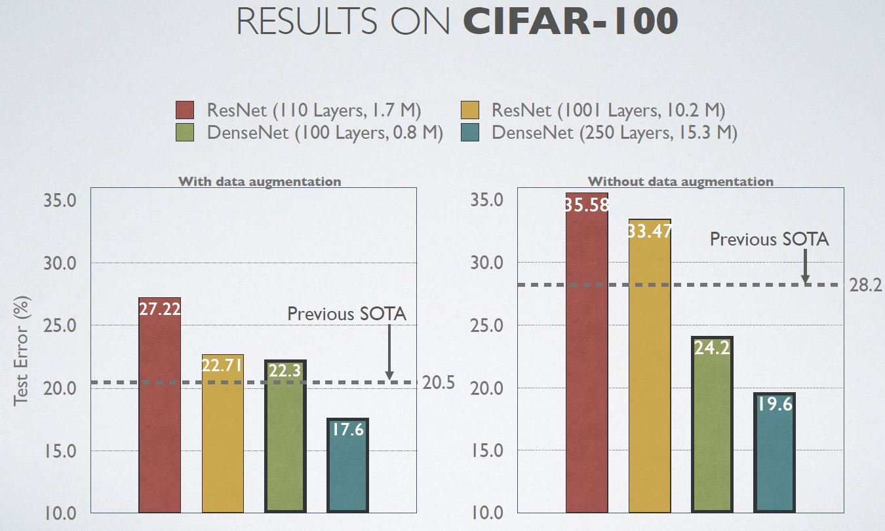

# Densenet-Tensorflow
Tensorflow implementation of [Densenet](https://arxiv.org/abs/1608.06993) using **MNIST**
* The code that implements *this paper* is ***Densenet.py***
* The code that applied *dropout* is ***Densenet_dropout.py***
* There is a *slight difference*, I used ***AdamOptimizer***

## Requirements
* Tensorflow 1.x
* Python 3.x
* tflearn (If you are easy to use ***global average pooling***, you should install ***tflearn***
```bash
However, I implemented it using tf.layers, so don't worry
And if you use tflearn, you may also need to install h5py and curses using pip.
```

## Idea
### What is the "Global Average Pooling" ? 
```python
    width = np.shape(x)[1]
    height = np.shape(x)[2]
    pool_size = [width, height]
    return tf.layers.average_pooling2d(inputs=x, pool_size=pool_size, strides=stride)
````
* If you use tflearn, please refer to this [link](http://tflearn.org/layers/conv/#global-average-pooling)

### What is the "Dense Connectivity" ?


### What is the "Densenet Architecture" ?


### What is the "Dense Block" ?


## Compare Structure (CNN, ResNet, DenseNet)


## Results
* (***MNIST***) The highest test accuracy is ***99.2%*** (This result does ***not use dropout***)
* The number of dense block layers is fixed to ***4***
```python
        for i in range(self.nb_blocks) :
            # original : 6 -> 12 -> 32

            x = self.dense_block(input_x=x, nb_layers=4, layer_name='dense_'+str(i))
            x = self.transition_layer(x, scope='trans_'+str(i))
```

### CIFAR-10


### CIFAR-100


### Image Net


## Author
Junho Kim
